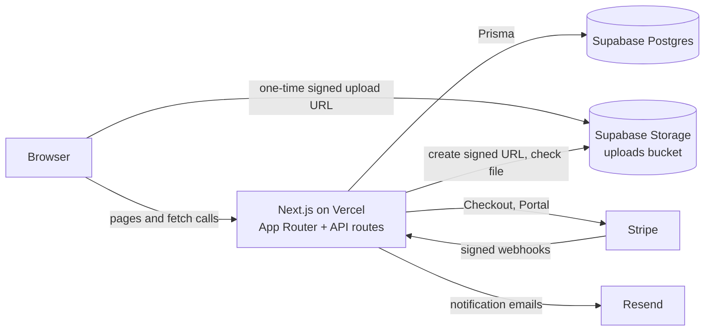
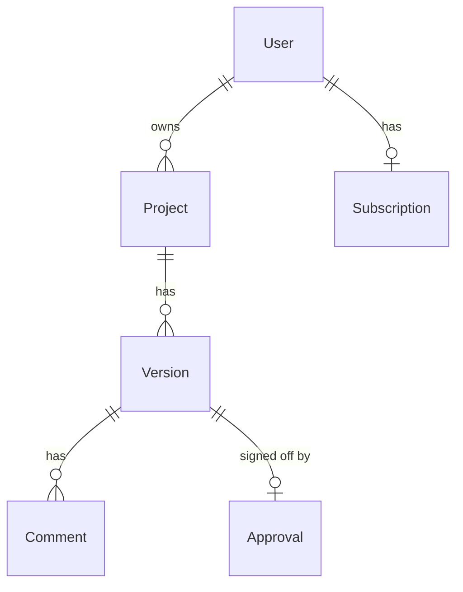
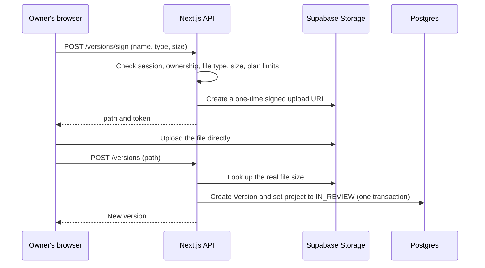
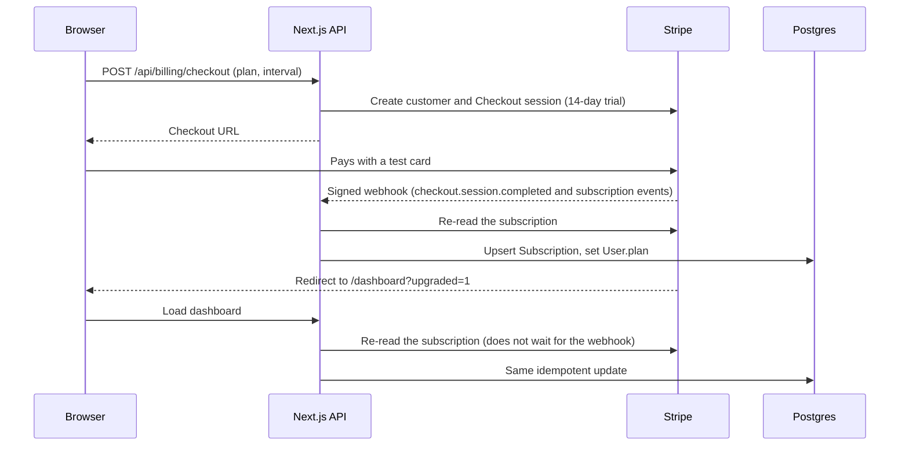

# Loopdesk

**Client feedback and approval for freelancers and small studios.** Upload a design, share a private link, and your client pins comments directly on it and approves with one click. No account needed for the client.

> **Demo project.** Loopdesk is a portfolio project. The customers, reviews and quotes on the marketing pages are sample content, and Stripe runs in **test mode** (no real payments). Use card `4242 4242 4242 4242` with any future date and any CVC.

**Live demo:** https://YOUR-APP.vercel.app  ·  **Case study:** _link to your case study_


## What it does

| Owner (signed in) | Client (no account) |
|---|---|
| Create projects and upload versions (PNG, JPG, WebP, GIF, PDF, MP4, MOV) | Opens a private link `/r/<token>` |
| Gets a private review link per project | Drops numbered pins on an image and writes comments |
| Sees every comment, with its pin shown on the image | Posts general comments on PDFs and videos |
| Resolves or reopens comments | Approves the version with a name and email |
| Gets email alerts for new feedback and approvals | Sees the approval and its date |
| Upgrades to a paid plan through Stripe | |


### Feature list

- **Accounts:** sign up, log in, log out. Passwords hashed with bcrypt, sessions in an httpOnly cookie, `/dashboard` protected by middleware.
- **Projects and versions:** every upload becomes a numbered version. A new version re-opens the project for review.
- **Pinned comments:** pin positions are stored as percentages, so they land in the same place on any screen size.
- **Approval:** records who approved, their email and the time, and closes the version for new comments.
- **Plan limits, enforced on the server:** Free allows 2 projects, 3 versions per project and 1 GB. Paid plans raise these limits (table below).
- **Billing:** Stripe Checkout with a 14-day trial, Stripe's customer portal for changes and cancellation, and a signature-verified webhook that keeps the user's plan in sync.
- **Email:** owner notifications through Resend. Comment emails are throttled to one per project every 5 minutes.
- **Contact form:** saved to the database, optionally emailed to the owner, with a honeypot field against bots.
- **Abuse protection:** database-backed rate limiting on signup, login, contact, comments and approvals.
- **Signed-in experience:** different navigation for signed-in users, a dashboard with open-comment counts and a "needs your attention" list, and a pricing page that knows your current plan.
- **Marketing site:** seven pages (home, features, pricing, about, case studies, contact, sign up) that are responsive, support dark mode and have keyboard focus styles.
- **Tests:** 26 automated tests (Vitest).

### Plan limits

| | Free | Pro | Studio |
|---|---|---|---|
| Projects | 2 | Unlimited | Unlimited |
| Versions per project | 3 | Unlimited | Unlimited |
| Storage | 1 GB | 50 GB | 200 GB |
| Largest single file | 50 MB | 50 MB | 50 MB |

## Architecture



Everything runs in one Next.js app. Pages are React Server Components where they read data, with small client components for interactive parts (pin demo, forms, pricing toggle). The API routes hold all business rules, so the browser is never trusted.

### Data model



Two more tables stand alone: `ContactMessage` (contact form) and `RateLimit` (one row per counted request). The full schema is in [`prisma/schema.prisma`](prisma/schema.prisma).

Comments belong to a **version**, not a project, so feedback on v1 never leaks into v2. A version has at most one approval, enforced by a unique constraint.

### Upload flow

The file goes straight from the browser to storage. The server never handles the bytes, but it decides whether the upload is allowed and checks the result.



### Billing flow

The webhook is the source of truth for a user's plan. The redirect back from Stripe is only a convenience, because people can close the tab or edit a URL.



Every webhook event re-reads the subscription from Stripe instead of trusting the event payload, so out-of-order or repeated events produce the same result.

## Tech stack

| Area | Choice |
|---|---|
| Framework | Next.js 14 (App Router), React 18, TypeScript |
| Styling | Tailwind CSS |
| Database | PostgreSQL on Supabase, Prisma ORM |
| File storage | Supabase Storage with signed uploads |
| Auth | Own implementation: bcryptjs, JWT (`jose`) in an httpOnly cookie |
| Validation | Zod |
| Payments | Stripe Checkout, Customer Portal, webhooks (test mode) |
| Email | Resend (HTTP API) |
| Tests | Vitest |
| Hosting | Vercel |

## Project structure

```
app/
  page.tsx, features/, pricing/, about/, case-studies/, contact/   marketing pages
  login/, signup/                                                  auth pages
  dashboard/, dashboard/[id]/                                      owner area
  r/[token]/                                                       public client review page
  api/                                                             all server routes (below)
  error.tsx, not-found.tsx                                         friendly error pages
components/   Header, Footer, Form, PinDemo, PricingPlans, ReviewClient, CommentList, UploadVersion ...
lib/          auth, db, validators, plans, storage, review, billing, stripe, email, rate-limit, content
prisma/       schema.prisma and migrations
tests/        Vitest tests
middleware.ts protects /dashboard
```

### Pages

| Route | Who | Purpose |
|---|---|---|
| `/` | Visitors (signed-in users go to `/dashboard`) | Landing page with an interactive pin demo |
| `/features`, `/about`, `/case-studies` | Everyone | Marketing content |
| `/pricing` | Everyone | Plans, monthly/yearly toggle, shows your current plan when signed in |
| `/contact` | Everyone | Contact form |
| `/signup`, `/login` | Visitors | Account creation and login |
| `/dashboard` | Owner | Counts, open comments, project list, billing |
| `/dashboard/[id]` | Owner of that project | Review link, pinned feedback, versions, upload |
| `/r/[token]` | Anyone with the link | Client review and approval |

### API routes

| Method and route | Access | Purpose |
|---|---|---|
| `POST /api/auth/signup` | Public, rate limited | Create account and session |
| `POST /api/auth/login` | Public, rate limited | Log in |
| `POST /api/auth/logout` | Session | Clear session |
| `GET /api/auth/me` | Session | Current user |
| `GET, POST /api/projects` | Session | List projects, create one (plan limit checked) |
| `DELETE /api/projects/[id]` | Owner | Delete project and its files |
| `POST /api/projects/[id]/versions/sign` | Owner | Validate an upload and return a signed upload URL |
| `POST /api/projects/[id]/versions` | Owner | Record an uploaded version |
| `PATCH /api/comments/[id]` | Owner | Resolve or reopen a comment |
| `POST /api/review/[token]/comments` | Review link, rate limited | Add a pinned or general comment |
| `POST /api/review/[token]/approve` | Review link, rate limited | Approve the latest version |
| `POST /api/billing/checkout` | Session | Start Stripe Checkout |
| `POST /api/billing/portal` | Session | Open Stripe's billing portal |
| `POST /api/stripe/webhook` | Stripe signature | Sync subscriptions |
| `POST /api/contact` | Public, rate limited | Save a contact message |

Errors use one shape: `{ "error": "Readable message", "code": "MACHINE_CODE" }`.

## Security decisions

- **Server-side rules.** Ownership, plan limits, file type and size are all checked in the API. Hiding a button is never the only protection.
- **Ownership checks** use the signed-in user's id in the query itself, so someone else's project returns "not found".
- **Passwords** are hashed with bcrypt (cost 12). Login gives the same error for a wrong email or a wrong password, and does comparable work either way.
- **Sessions** live in an httpOnly, SameSite=Lax cookie (Secure in production), so page scripts cannot read them.
- **Review links** use unguessable random tokens and are excluded from search engines.
- **Uploads:** an allow-list of file types, a size cap, random file names (the original name is never used) and the real size read back from storage rather than trusted from the browser.
- **Untrusted text** (comments, contact messages) is escaped before it goes into emails, and React escapes it on pages.
- **Webhooks** are only accepted with a valid Stripe signature.
- **Rate limiting** keys on a salted hash of the visitor's IP, so IP addresses are not stored.
- **Concurrency:** double approvals are stopped by a database unique constraint, and the comment-email throttle claims its time slot atomically.

## Getting started

Requires Node.js 18.17 or newer, a free [Supabase](https://supabase.com) project, a [Stripe](https://stripe.com) account in test mode, and a [Resend](https://resend.com) account.

```bash
git clone https://github.com/YOUR-USERNAME/loopdesk.git
cd loopdesk
npm install
cp .env.example .env        # then fill in the values (see the table below)
npx prisma migrate dev      # creates the tables
npm run dev                 # http://localhost:3000
```

1. **Storage:** in Supabase, create a **public** bucket named exactly `uploads` with a 50 MB file size limit.
2. **Stripe customer portal:** in test mode, activate it under Settings, Billing, Customer portal.
3. **Webhook (local):** install the Stripe CLI, run `stripe login`, then keep this running while you develop:
   ```bash
   stripe listen --events checkout.session.completed,customer.subscription.created,customer.subscription.updated,customer.subscription.deleted --forward-to localhost:3000/api/stripe/webhook
   ```
   Put the `whsec_...` value it prints into `STRIPE_WEBHOOK_SECRET` and restart the dev server.

### Environment variables

| Variable | Secret? | Purpose |
|---|---|---|
| `DATABASE_URL` | Yes | Supabase Postgres connection string (session pooler) |
| `JWT_SECRET` | Yes | Signs session cookies and salts the IP hash |
| `NEXT_PUBLIC_SUPABASE_URL` | No | Project URL, exactly `https://<ref>.supabase.co` |
| `NEXT_PUBLIC_SUPABASE_ANON_KEY` | No | Publishable key, used by the browser to upload with a signed token |
| `SUPABASE_SERVICE_ROLE_KEY` | **Yes** | Server-only storage access |
| `STRIPE_SECRET_KEY` | **Yes** | Stripe test secret key |
| `STRIPE_WEBHOOK_SECRET` | **Yes** | Verifies webhook signatures |
| `RESEND_API_KEY` | **Yes** | Sends email |
| `CONTACT_TO_EMAIL` | No | Optional copy of contact-form messages |
| `EMAIL_FROM` | No | Optional sender (needs a verified Resend domain) |
| `APP_URL` | No | Base URL for email links and Stripe redirects |

Secrets are never committed. `.env` is in `.gitignore`.

### Tests

```bash
npm test
```

26 tests cover the input validation rules, plan limits and file-type allow-list, email escaping (a script tag in a comment cannot reach an email), the rate limiter (allow, block, no raw IPs stored, fails open) and the contact route (validation, honeypot, rate limit, errors).

## Deployment (Vercel)

1. Import the repo into Vercel and add every variable from the table above.
2. Set `APP_URL` to the production URL.
3. In the Stripe dashboard, add a webhook endpoint at `https://YOUR-APP.vercel.app/api/stripe/webhook` for the four events listed above, and put **its** signing secret in `STRIPE_WEBHOOK_SECRET` (it is different from the CLI's).
4. Make sure Prisma Client is generated during the build, for example with `"postinstall": "prisma generate"` in `package.json`.
5. For heavier traffic, move the app to Supabase's transaction pooler and add a `directUrl` for migrations.

## Known limitations

Being upfront about scope:

- **The marketing pages describe a bigger product than the app implements.** Not built: side-by-side version comparison, password-protected review links, custom branding, team seats for the Studio plan, tiered support, and pins on PDFs and videos (those get general comments only).
- No email verification or password reset yet.
- Review files are served from a public bucket. The paths are random and unguessable, but anyone with a file's exact URL can open it.
- Clients receive no confirmation email. On Resend's free sandbox sender, mail only goes to the account owner's address.
- Plan changes between paid plans happen in Stripe's portal, and the portal's plan switching has to be enabled in Stripe.
- Stripe is in test mode only.
- Sessions are stateless 7-day tokens, so a single session cannot be revoked early.
- The rate limiter fails open: if its own database call fails, requests are allowed.
- No end-to-end browser tests yet.

## Roadmap

Email verification and password reset, pins on PDFs and video timestamps, side-by-side version comparison, password-protected links, team seats, a Playwright end-to-end suite, and CI that runs the tests on every push.

## Author

Built by **[Your Name]**. [Portfolio](https://your-portfolio.example) · [LinkedIn](https://linkedin.com/in/your-handle) · [Email](mailto:you@example.com)
