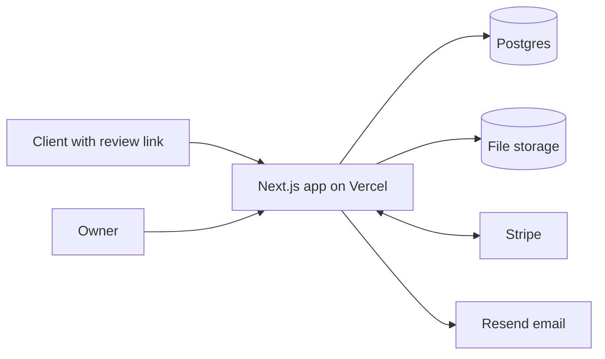

# Building Loopdesk: a client approval tool, front to back

Loopdesk lets a freelancer upload a design, send a private link, and have the client pin comments on it and approve with one click. I built it end to end as a portfolio project: a marketing site, accounts, file uploads, a no-login client review page, Stripe subscriptions in test mode, email notifications and automated tests.

## The problem

Freelancers collect feedback through email threads, chat messages and calls. Files are called `v3_FINAL_final2`, nobody is sure which version a comment refers to, and approvals stall for weeks. Two things make this fixable: feedback should be attached to a spot on the work, and the client should not need an account to give it.

Loopdesk is an invented product. I chose it because its features map onto the backend work employers ask about: authentication, a relational data model, file uploads, permissions, payments, email and abuse protection.

## Goals

- Look like a real product from the first click, with a clear conversion path.
- Show full-stack range, not just screens: auth, database design, uploads, billing and email.
- Keep the risky rules on the server. Anything checked only in the browser can be bypassed.
- Write down what is not built, instead of letting the marketing copy imply it.

## How I approached it

I wrote the page structure and copy first, and built the homepage as plain HTML, CSS and JavaScript so I could judge the design quickly. Then I rebuilt it in Next.js and Tailwind as components, with all copy and pricing data in one file.

Before writing backend code I planned the data model and the API routes, then built the backend in six steps that each worked on their own: accounts, projects and uploads, the client review page, email alerts, Stripe billing, and finally the contact form, rate limiting, error pages and tests. After each step I ran it against real Supabase, Stripe and Resend accounts.

I used an AI assistant (Claude) to plan the build and draft code step by step. I ran every step myself and worked through the problems that came up, which are described below.

## Architecture

One Next.js app serves the pages and the API. Pages that read data are server components, and small client components handle the interactive parts: the pin demo, the forms and the pricing toggle. The data lives in eight Postgres tables, accessed through Prisma.

## Decisions that mattered

| Decision | Why | Trade-off |
|---|---|---|
| One Next.js app for pages and API | One deploy, shared types, less to operate | Frontend and backend scale together |
| Rules enforced on the server | Plan limits, ownership and file types cannot be bypassed from the browser | More server code, and every refusal needs a message the UI can show |
| Clients use a secret link, not an account | No sign-up friction, which is the product's main promise | Anyone with the link can comment, so links are random and unlisted, and comments are rate limited |
| Pin positions stored as percentages | Pins stay in the same place on any screen size | PDFs and video need a different model, so they get general comments only |
| Uploads go straight to storage with a signed URL | File bytes never pass through my server, and limits are checked first | The server must verify the result afterwards, so it reads the real file size back |
| The webhook decides a user's plan | A user cannot fake an upgrade by editing a URL | Needs extra setup locally, and a second path to cover it (see below) |
| Rate limits stored in the database | Works on serverless hosting, where memory is not shared | One extra query per protected request, and it fails open |
| My own auth (bcrypt and a cookie session) | I wanted to understand hashing, sessions and middleware | No email verification or password reset yet, and one session cannot be revoked early |

## Problems I ran into

**The database would not connect.** Supabase offers three connection strings. The direct one can fail on networks without IPv6, and the pooler needs the username `postgres.<project-ref>`, not plain `postgres`. Using the wrong one gave an authentication error. Later, a project URL with extra path on the end produced a confusing storage error that looked like a permissions problem. Reading where an error comes from, before changing code, saved time each time.

**I paid, and the app still said Free.** After a successful test payment the dashboard kept the Free plan, because Stripe's webhook was not reaching my local server. The webhook stays the source of truth, but when someone returns from checkout the dashboard now asks Stripe directly for their subscription and applies the same update. Every event re-reads the subscription from Stripe rather than trusting its payload, so repeated or out-of-order events give the same result. The same bug showed that the Manage billing button was hidden whenever the plan looked free, so it now appears whenever a subscription exists.

**Signed-in users saw the sales site.** The header was static, so after logging in people still saw Log in buttons and marketing links, and had no clear way back to their projects. The layout now reads the session. Signed-in users get app navigation (Projects, Plans, Support), the homepage sends them to their dashboard, and the pricing page shows their current plan. The cost is that pages render per request instead of being fully static.

**Two things happening at once.** If two people press Approve together, a database unique constraint lets one succeed and returns a clear message to the other. Comment emails are throttled to one per project every five minutes, and the time slot is claimed with a single conditional update so two simultaneous comments cannot both send.

## Testing

There are 26 automated tests with Vitest. They cover input validation, plan limits and the allowed file types, email escaping (a comment containing a script tag cannot reach an email as HTML), the rate limiter (it allows, blocks, never stores raw IP addresses and fails open) and the contact route (validation, the spam trap, rate limiting and database errors).

Not covered yet: browser end-to-end tests, the Stripe webhook handler and the upload flow. Those parts I checked by hand.

## What it does today

- Visitors read a seven-page marketing site, try an interactive pin demo and create an account.
- Owners create projects, upload versions, share a review link, see client pins on the image, resolve comments and get emailed.
- Clients open a link with no account, pin comments, and approve with a recorded name, email and time.
- Owners upgrade through Stripe Checkout with a 14-day trial, and manage or cancel in Stripe's portal.
- The contact form saves to the database, and the sensitive routes are rate limited.

## Limits

- The marketing pages describe a bigger product than the app implements. Side-by-side version comparison, password-protected links, custom branding, team seats and pins on PDFs and video are not built.
- There is no email verification or password reset, and uploaded files sit in a public bucket behind unguessable paths.
- Stripe runs in test mode only.

## What I would do next

Add Playwright end-to-end tests for the path from signup to approval, tests for the webhook handler using Stripe's event fixtures, email verification and password reset, pins on PDFs and video timestamps, and a CI run of the tests on every push.

## What I learned

- Put the rules where they cannot be bypassed, and keep the interface as a convenience on top.
- Treat events from outside services as hints. Re-read the real state, and make the update safe to repeat.
- A portfolio project is stronger when its limits are written down plainly.
